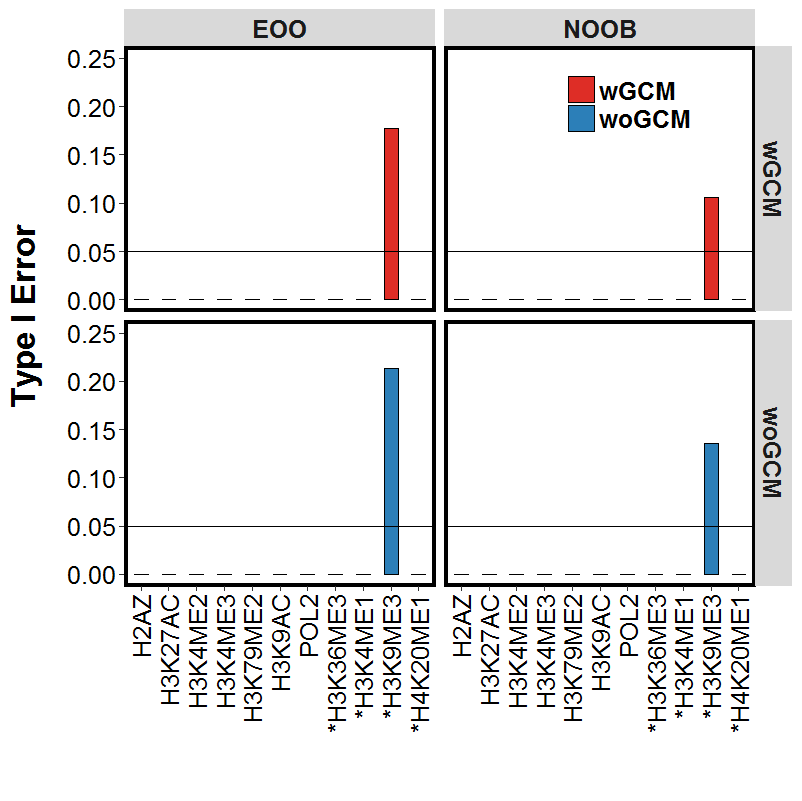

============================================
GLANET Data Driven Computational Experiments
============================================

In order to assess the statistical power and Type-I error control of GLANET, we designed data-driven computational experiments using large collections of ENCODE ChIP-seq and RNA-seq data. 
These experiments indicated that while GLANET enrichment test often performs conservatively in terms of Type-I error, it has high statistical power.

We have used histone modification, DNA polymerase II (POL2) ChIP-seq and RNA-seq data.
We have focused on 12 histone modifications and POL2 in promoter regions of expressed and non-expressed genes.

As ground truth, we considered histone modifications  and POL2 occupancy in three groups:

* Activator elements: H2AZ, H3K27ac, H3K4me2, H3K4me3, H3K79me2, H3K9ac, H3K9acb, and POL2
* Repressor elements: H3K27me3
* Ambigious elements (exhibit both activator and repressor features): H3K36me3, H3K4me1, H3K9me3 and H4K20me1

We have filled our genomic interval pool by promoter regions of genes by considering 500 bps upstream and 100 bps downstream of genes in GM12878 and K562 RNA-seq data.

We have labeled genes with zero Transcript Per Million (TPM) as non-expressed genes.
We have defined two genomic interval pools from non-expressed genes.
It has been shown that DNaseI hypersensitivity and gene expression correlate.
Therefore we have excluded DNaseI overlap from these promoter regions in two modes.

* CompletelyDiscard: If promoter region overlaps with any DNaseI  hypersensitive sites of the corresponding cell line, discard the interval completely.
* TakeTheLongest: : If promoter region overlaps with any DNaseI  hypersensitive sites of the corresponding cell line, remove that overlap, there might be more than one remaining intervals, choose the longest one among remaining intervals

We have defined three genomic interval pools from expressed genes.
We have sorted the genes w.r.t. their TPM values in descending order.

* Top5: We considered the top 5th percentile of the genes in expressed genes interval pools.
* Top10: We considered the top 10th percentile of the genes in expressed genes interval pools.
* Top20: We considered the top 20th percentile of the genes in expressed genes interval pools.

As a result, we have 5 pools, 2 pools for non-expressed genes and 3 pools for expressed genes.

GM12878 and K562 RNA-seq data have two biological replicates.
We have considered the lowest and highest TPM values across replicates for defining the expressed and non-expressed genes, respectively.

For each interval pool, we had 1000 simulations.
For each simulation, we have sampled 500 random non-overlapping intervals from 	the corresponding interval pool.

We have run each simulation with 4 different settings of GLANET:

* (wGCM, EOO)
* (woGCM, EOO)
* (wGCM, NOOB)
* (woGCM,NOOB)

+------------------------------------------------------+ 
| Data-Driven Computational Experiment                 |
+==========================================+===========+ 
| Number of interval pools                 | 5         | 
+------------------------------------------+-----------+ 
| Number of Simulations                    | 1000      | 
+------------------------------------------+-----------+ 
| Number of GLANET runs for each simulation| 1000      | 
+------------------------------------------+-----------+ 
| Number of cell lines (GM12878 and K562)  | 2         |
+------------------------------------------+-----------+ 
| Total number of GLANET Runs              | 40000     |
+------------------------------------------+-----------+ 

   GM12878, Non-expressing genes, alpha=0.05, CompletelyDiscard, Type-I Error
   
.. figure:: ../images/ddce/woIF_empiricalPValues/GM12878_Exp_Activators_Power_SigLev_0_05_Facet_Top5.png
   :align: center
   :alt: GM12878_Exp_Activators_Power_SigLev_0_05_Facet_Top5

   GM12878, Expressing genes, alpha=0.05, Top5, Power