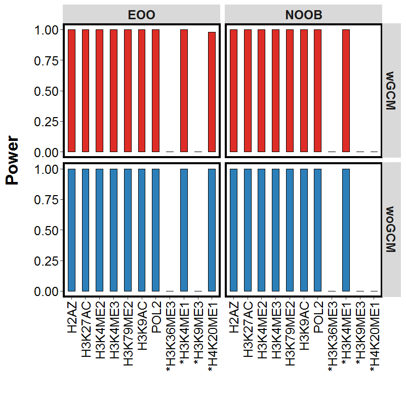

============================================
GLANET Data Driven Computational Experiments
============================================

In order to assess the statistical power and Type-I error control of GLANET, we designed data-driven computational experiments using large collections of ENCODE ChIP-seq and RNA-seq data. 
These experiments indicated that while GLANET enrichment test often performs conservatively in terms of Type-I error, it has high statistical power.

.. figure:: ../images/ddce/woIF_empiricalPValues/GM12878_NonExp_Activators_TypeIError_SigLev_0_05_Facet_CompletelyDiscard.png
   :align: center
   :alt: GM12878_Non_expressing_genes_alpha_0_05_CompletelyDiscard

   GM12878, Non-expressing genes, alpha=0.05, CompletelyDiscard, Type-I Error
   

   GM12878, Non-expressing genes, alpha=0.05, Top5, Power