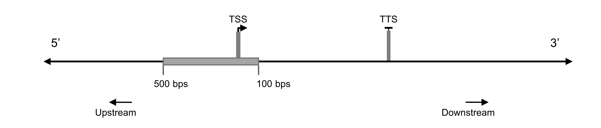
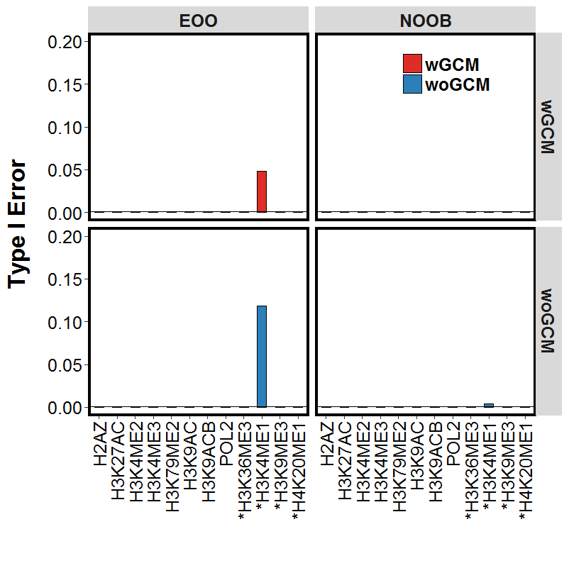
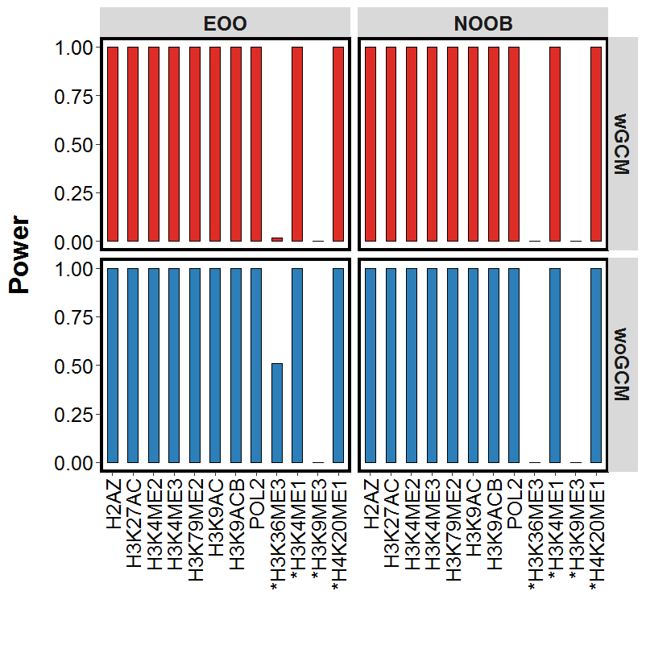

.. include:: <isogrk1.txt>

============================================
GLANET Data Driven Computational Experiments
============================================

**Motivation**

In order to assess the statistical power and Type-I error control of GLANET, we designed data-driven computational experiments using large collections of ENCODE ChIP-seq and RNA-seq data. 
These experiments indicated that while GLANET enrichment test often performs conservatively in terms of Type-I error, it has high statistical power.

**Data**

We have used histone modification, DNA polymerase II (POL2) ChIP-seq and RNA-seq data.
We have focused on 12 histone modifications and POL2 in promoter regions of expressed and non-expressed genes.

**Genomic Elements**

As ground truth, we considered histone modifications  and POL2 occupancy in three groups:

* **Activator elements**: H2AZ, H3K27ac, H3K4me2, H3K4me3, H3K79me2, H3K9ac, H3K9acb, and POL2
* **Repressor elements**: H3K27me3
* **Ambigious elements** (exhibit both activator and repressor features): H3K36me3, H3K4me1, H3K9me3 and H4K20me1
  
  
**Interval Pools**

We have filled our genomic interval pool by promoter regions of genes by considering 500 bps upstream and 100 bps downstream of genes in GM12878 and K562 RNA-seq data.

   Figure 1: Data-driven Computational Experiment Interval

We have labeled genes with zero Transcript Per Million (TPM) as non-expressed genes.
We have defined **2 genomic interval pools from non-expressed genes**.
It has been shown that DNaseI hypersensitivity and gene expression correlate.
Therefore we have excluded DNaseI overlap from these promoter regions in two modes:

1. **CompletelyDiscard**: If promoter region overlaps with any DNaseI hypersensitive sites of the corresponding cell line, discard the interval completely.
2. **TakeTheLongest**: : If promoter region overlaps with any DNaseI hypersensitive sites of the corresponding cell line, remove that overlap, there might be more than one remaining intervals, choose the longest one among remaining intervals.

We have defined **3 genomic interval pools from expressed genes**.
We have sorted the genes w.r.t. their TPM values in descending order.

1. **Top5**: We considered the top 5th percentile of the genes in expressed genes interval pool.
2. **Top10**: We considered the top 10th percentile of the genes in expressed genes interval pool.
3. **Top20**: We considered the top 20th percentile of the genes in expressed genes interval pool.

As a result, we have 5 interval pools at total, 2 of them from non-expressed genes and 3 of them from expressed genes.

**Note:**
GM12878 and K562 RNA-seq data have two biological replicates.
We have considered the lowest and highest TPM values across replicates for defining the expressed and non-expressed genes, respectively.

**Data-driven Computational Experiment Design**

We have performed the data-driven computational experiments summarized in table below under the six enrichment analysis settings of GLANET by varying association measures as **EOO** or **NOOB** and random interval generation mode as **wGCM** or **woGCM** and tested **wGCM** with two modes of Isochore Family, **wIF** or **woIF** for null distribution estimation.

+----------------------------------------------------------------------------------------------------+ 
|                                               Null Hypotheses                                      |
+====================+=====================================+=========================================+
| Genomic Elements   | Promoter regions of expressed genes | Promoter regions of non-expressed genes |
|                    |    are not enriched for genomic     |      are not enriched for genomic       |
|                    |          element j                  |            element j                    |              
+--------------------+-------------------------------------+-----------------------------------------+                                            
| Activator Elements |             Power                   |             Type-I Error                |
+--------------------+-------------------------------------+-----------------------------------------+ 
| Repressor Elements |          Type-I Error               |                 Power                   |                
+--------------------+-------------------------------------+-----------------------------------------+ 

We have considered empirical p-values in these experiments.
We varied the definitions of non-expressed and expressed genes and repeated the experiments for each setting. 
 
For each interval pool, we had 1000 simulations.
For each simulation, we have sampled 500 random non-overlapping intervals from 	the corresponding interval pool.

We have run each simulation with 4 different settings of GLANET by varying association measures such as **EOO** or **NOOB** and random interval generation mode such as **wGCM** or **woGCM**.
Furthermore, we have tested **wGCM** with Isochore Family, **wIF**.

* *(wGCM, EOO)*
* *(wGCM, EOO, wIF)*
* *(woGCM, EOO)*
* *(wGCM, NOOB)*
* *(wGCM, NOOB, wIF)*
* *(woGCM,NOOB)*

+------------------------------------------------------+ 
| Data-Driven Computational Experiment                 |
+==========================================+===========+ 
| Number of interval pools                 | 5         | 
+------------------------------------------+-----------+ 
| Number of Simulations                    | 1000      | 
+------------------------------------------+-----------+ 
| Number of GLANET runs for each simulation| 6         | 
+------------------------------------------+-----------+ 
| Number of cell lines (GM12878 and K562)  | 2         |
+------------------------------------------+-----------+ 
| Total number of GLANET Runs              | 60000     |
+------------------------------------------+-----------+ 

In these experiment, our null hypothesis is that there is no enrichment.s

**Data-driven Computational Experiments Results**

We provide Type-I error and power for significance level of |agr| = 0.05 and |agr| = 0.001.

**Repressor elements**

For **woIF**

Experiments in K562 cell line for H3K27me3 resulted in power of 1 and Type-I error of 0 in all parameter settings. 
Experiments conducted in GM12878 cell line for H3K27me3 resulted in power of 1 and Type-I error of 0 except few cases listed in the table below. 
In each case, Type-I error is below the significance level of |agr| = 0.05.

+-------------------------------------------+ 
| Expressed Genes, |agr| = 0.05.            |
+====================+======+=======+=======+ 
| Parameters         | Top5 | Top10 | Top20 |
+--------------------+------+-------+-------+
| GLANET(woGCM,EOO)  | 0    | 0     | 0.006 |
+--------------------+------+-------+-------+
| GLANET(woGCM,NOOB) | 0    | 0.002 | 0.008 |
+--------------------+------+-------+-------+
| GLANET(wGCM,EOO)   | 0    | 0     | 0     |
+--------------------+------+-------+-------+
| GLANET(wGCM,NOOB)  | 0    | 0     | 0     |
+--------------------+------+-------+-------+

For **wIF**

Experiments in K562 and GM12878 cell lines for H3K27me3 resulted in power of 1 and Type-I error of 0 in all parameter settings. 

**Activator elements**

For **woIF**

Figure 2,3,4, and 5 below summarizes the main results for activator elements, for woIF.  Figures for all results are provided in the Supplementary Materials for GLANET paper.

This setting includes expressed genes as the ones with TPM values in the top 5th percentile and non-expressed genes exclude zero TPM genes with DNaseI signal at the promoters with the **CompletelyDiscard** mode. 

Results are reported at significance level, |agr|  = 0.05 and |agr| = 0.001 for GM12878 and K562, respectively.

Overall, we observe that the Type-I error is well below the target significance level for all the experiments where the activator elements are unambiguously related to transcriptional activation and the power is high with all four modes of the GLANET enrichment analysis.

In Figure 2, Type-I error for H3K9me3 is significantly higher than the target level. 

This could potentially be attributed to repressor properties of H3K9me3.

The results with other histone marks highlight differences between the four enrichment analysis variations. 

This is especially evident for the K562 experiments involving H3K4me1 in Figure 4.

Although H3K4me1 is, in general, tightly linked to enhancer activity, it is also abundantly observed around 5' portions of actively transcribed genes and exhibits repressor features. 

Interestingly, enrichment assessment of this mark for expressed genes is most affected by the mappability and GC adjustment in the null distribution estimation. 

The Type-I error involving this mark improves significantly under the **with GC and Mappability** regardless of the association statistics utilized for enrichment without a negative impact on power. 

Overall, it is evident that Type-I error control is significantly better with the **NOOB** association statistics without loss of power. 

.. figure:: ../images/ddce/woIF_empiricalPValues/GM12878_NonExp_Activators_TypeIError_SigLev_0_05_Facet_CompletelyDiscard.png
   :align: center
   :alt: GM12878_Non_expressing_genes_alpha_0_05_CompletelyDiscard

   Figure 2: GM12878, Non-expressing genes, |agr| = 0.05, CompletelyDiscard, Type-I Error

 
.. figure:: ../images/ddce/woIF_empiricalPValues/GM12878_Exp_Activators_Power_SigLev_0_05_Facet_Top5.png
   :align: center
   :alt: GM12878_Exp_Activators_Power_SigLev_0_05_Facet_Top5

   Figure 3: GM12878, Expressing genes, |agr| = 0.05, Top5, Power

   

   Figure 4: K562, Non-expressing genes, |agr| = 0.001, CompletelyDiscard, Type-I Error   

   Figure 5: K562, Expressing genes, |agr| = 0.001, Top5, Power   
	
	
For **wIF**

By using wIF option, Type-I error and power both have decreased.

This is valid for both of the cell lines (GM12878 and K562), and under all scenarios of non-expressed (CompletelyDiscard, TakeTheLongest) genes and expressed (Top5, Top10, Top20) genes.
Type-I error has decreased for both activator and ambiguous elements whereas power has decreased only for ambiguous elements.
Furthermore, in some cases, decrease in Type-I error has made Type-I error less than pre-set significance level, |agr|.

All the cases where Type-I error has made a change w.r.t. pre-set significance level, |agr| are given below:
In other words, Type-I error has decreased such that it has become less than or equal to significance level, |agr| however it was greater than pre-set significance level in woIF:

H3K9me3 (Ambiguous) *GM12878, non-expressed genes (Completely Discard), (NOOB,wGCM)*, Type-I error has become equal to significance level of |agr| = 0.001.

H3K4me3  *GM12878, non-expressed genes (TakeTheLongest), (EOO,wGCM)*, Type-I error has become less than significance level of |agr| = 0.05.

H3K4me1 (Ambiguous)  *K562, non-expressed genes (Completely Discard), (NOOB,wGCM)*, Type-I error has become less than significance level of |agr|, 0.05.

H3K4me1 (Ambiguous)  *K562, non-expressed genes (Completely Discard), (EOO,wGCM)*, Type-I error has become 0.004 whereas significance level of |agr| is 0.001.

H3K9ACB, H4K20me1 (Ambiguous)  *K562, non-expressed genes (TakeTheLongest), (EOO,wGCM)*, Type-I error has become less than significance level of |agr|, 0.05. 

	