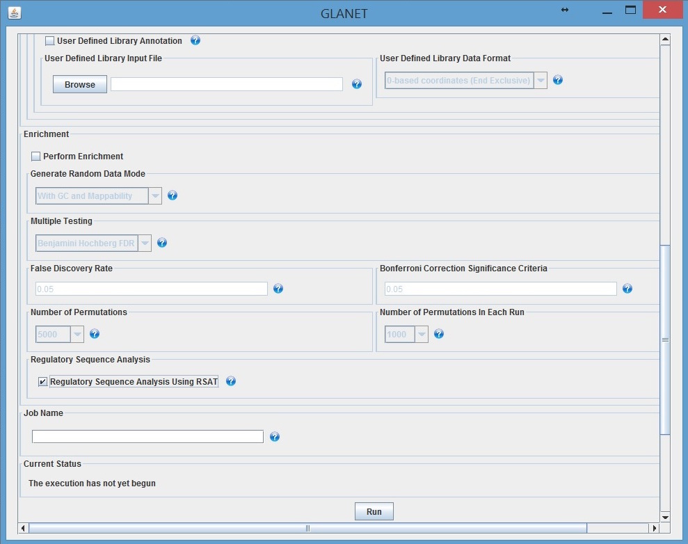

===============
GLANET Tutorial
===============

GLANET includes both graphical user interface (GUI) and command-line interface.
In either case, to run GLANET, one should write the following basic command on Terminal (Linux or Mac OS X) or on Command Prompt (Windows)\*::

	$ java -Xms4096M -Xmx8192M −jar ~path/to/GLANET.jar

Note that we ask you to allow GLANET to allocate 8GB of memory in order to make use of all GLANET facilities.

\* Throughout the guide, we will use ~path/to/GLANET.jar to indicate your absolute path to GLANET.jar

-------------------------------
GLANET Graphical User Interface
-------------------------------

.. figure:: ../images/GLANET_GUI_UpperPart.jpg
   :alt: GLANET_GUI_UpperPart

   GLANET GUI Upper Part

GLANET provides Annotation by enabling user to annotate given genomic intervals w.r.t. ENCODE regulatory elements,
predefined gene sets such as KEGG Pathways, user defined gene sets and user defined library.

Other facilities of GLANET includes Enrichment Analysis and Regulatory Sequence Analysis.

1)	**Input File Name**: (Mandatory)

	You have to provide input file which contains user given genomic intervals.
	Assume that Data.zip is extracted under a directory called tool.
	Then sample input data can be reached from ~path/to/tool/Data/demo_input_data/.

2)	**Input Format**: (Mandatory)

	GLANET supports input formats such as *dbSNP IDs*, *BED*, *GFF3*, *1-based coordinates (End Inclusive)* and *0-based coordinates (End Inclusive)*.
	For the user given input file, Input Format has to be selected accordingly.

	* *dbSNP IDs*
		-  Sample input data for dbSNP IDs can be reached at
		| ~path/to/tool/Data/demo_input_data/CVD_rsIDs_Mediation.txt,
		-  Input Format must be selected as dbSNP IDs.

	* *BED*
		-  Sample input data for BED can be reached at
		| ~path/to/tool/Data/demo_input_data/
		| CVD_Mediation_0BasedStart_EndExclusive_GRCh37_p13_coordinates.bed,
		-  Input Format must be selected as BED.

	* *GFF3*
		-  Sample input data  can be reached at
		| ~path/to/tool/Data/demo_input_data/
		| CVD_Mediation_0Based_Start_End_GRCh37_p13_coordinates.gff3,
		-  Input Format must be selected as GFF3.

	* *1-based coordinates (End Inclusive)*
		-  Sample input data  can be reached at
		| ~path/to/tool/Data/demo_input_data/
		| OCD_GWAS_SNPs_chrNumber_1Based_GRCh37_p13_Coordinates.txt,
		-  Input Format must be selected as 1-based coordinates (End Inclusive).

	* *0-based coordinates (End Inclusive)*
		-  Sample input data  can be reached at
		| ~path/to/tool/Data/demo_input_data/
		| test_interval_data_K562_Usf2_0based_GRCh37_p13_Coordinates.txt,
		-  Input Format must be selected as 0-based coordinates (End Inclusive).

3)	**Assembly**: (Mandatory for *BED*, *GFF3*, *1-based coordinates (End Inclusive)* or *0-based coordinates (End Inclusive)*)

	GLANET supports two assemblies.

	* *GRCh38*
		-  GRCh38 is also known as hg38
	* *GRCH37.p13 (hg19)*
		-  GRCh37.p13 is also known as hg19

	If *BED*, *GFF3*, *1-based coordinates (End Inclusive)* or *0-based coordinates (End Inclusive)* is chosen as Input Format, then Assembly has to be set as either GRCh38 or GRCH37.p13.
	In case of dbSNP IDs, there is no need for Assembly selection.

4)	**Glanet Folder**: (Mandatory)

	Set the Glanet folder (e.g.:  ~path/to/tool).
	Please note that Glanet folder has to be the parent of Data folder (e.g.:  ~path/to/tool/Data).

5)	**Annotation, Overlap Definition, Number of Bases**: (Mandatory)

	For Annotation, set the number of bases for overlap definition.
	e.g: Setting number of bases as *3* means that two intervals are accepted as overlapped if and only if at least 3 bases of these intervals overlap.
	Default is *1* in order to handle the case where the SNPs are given as input data.

6) 	**Annotation, Annotation Options**: (At least one of the Annotation Option has to be checked)

	* *DNase Annotation (CellLine Based)*
		-  Check this check box, if you want to annotate given intervals w.r.t. ENCODE provided DNaseI hypersensitive sites.

	* *Histone Annotation (CellLine Based)*
		-  Check this check box, if you want to annotate given intervals w.r.t. ENCODE provided Histone modifications sites.

	* *Transcription Factor (TF) Annotation (CellLine Based)*
		-  Check this check box, if you want to annotate given intervals w.r.t. ENCODE provided Transcription Factors (TFs) binding sites.
		
	* *Gene Annotation* 
		-  Check this check box, if you want to annotate given intervals w.r.t. clade: Mammal, genome: Human, assembly: Feb. 2009 (GRCh37/hg19),  RefSeq Genes.

	* *KEGG Pathway Annotation*
		-  Check this check box, if you want to annotate given intervals w.r.t. KEGG Pathways in exon-based, regulation-based and all-based manner.

	* *TF and KEGG Pathway Annotation*
		-  Check this check box, if you want to annotate given intervals w.r.t. Transcription Factors binding sites and KEGG Pathways in exon-based, regulation-based and all-based manner.
		This is a joint annotation which means that given interval has overlapped with TF  and KEGG Pathway intervals, and these TF and KEGG Pathway intervals also overlap with each other.
		Here same TF with different cell lines are pooled.
		
		In other words, joint annotation requires trio overlaps.

	* *TF and KEGG Pathway Annotation (CellLine Based)*
		-  Check this check box, if you want to annotate given intervals w.r.t. Transcription Factors binding sites (CellLine Based) and KEGG Pathways in exon-based, regulation-based and all-based manner.
		This is a joint annotation which means that given interval has overlapped with TF and KEGG Pathway intervals, and these TF and KEGG Pathway also overlaps with each other.
	
		In other words, joint annotation requires trio overlaps.
		
	* *User Defined Gene Set Annotation*
		-  Check this check box, if you want to annotate given intervals w.r.t. User Defined Gene Set in exon-based, regulation-based and all-based manner.

		-  User Defined Gene Set Input File (Mandatory if *User Defined Gene Set Annotation* checkbox is checked.)
			-  User Defined Gene Set Input File contains tab delimited GeneSetID and Gene Information per line (e.g:.: GO:0031424	LCE6A).
			-  Sample User Defined Gene Set Input File can be reached at
			
			| ~path/to/tool/Data/demo_input_data/UserDefinedGeneSet/GO/
			| GO_gene_associations_human_ref.txt

		-  Gene Information Type (Mandatory if *User Defined Gene Set Annotation* checkbox is checked.)
		   	-  GLANET supports three Gene Information Types:
		   	-  GENE ID (e.g.: 728927)
		   	-  GENE SYMBOL (e.g.: TTC26)
		   	-  RNA NUCLEOTIDE ACCESSION (e.g.: NM_001294255)
			-  Choose the appropriate Gene Information Type. (e.g: Choose GENE SYMBOL if you have loaded GO_gene_associations_human_ref.txt as User Defined Gene Set Input File.)

		-  Name (Optional)
			-  You can give a name for the User Defined Gene Set (e.g.: GO)
			-  Default Name is *NoName*.

		-  Description File (Optional)
			-  Desription File contains tab delimited GeneSetID and description of GeneSet per line.(e.g.: GO:0000001	mitochondrion inheritance)
			-  Sample User Defined Gene Set Input File can be reached at
			
			   | ~path/to/tool/Data/demo_input_data/UserDefinedGeneSet/GO/
			   | GO_ids2terms.txt

	* *User Defined Library Annotation*
		-  Check this check box, if you want to annotate given intervals w.r.t. User Defined Library.
		   Please note that all the files that will be used in User Defined Library Annotation have to reside on your local machine.

		-  User Defined Library Input File (Mandatory if *User Defined Library Annotation* checkbox is checked.)
			- 	User Defined Library Input File contains tab delimited ~path/to/file, ElementType, ElementName and Optional window-size value for considering window around summit in case of TF Data per line
				
				(e.g:.: G:/DOKTORA_DATA/ENCODE/dnase_jul2010/AG09319-DS12291.peaks.fdr0.01.hg19.bed	Dnase	AG09319).
			
			-	Sample User Defined Library Input File can be reached at
				
				| ~path/to/tool/Data/demo_input_data/UserDefinedLibrary/
				| UserDefinedLibraryInputFile.txt

		-  User Defined Library Data Format (Mandatory if *User Defined Library Annotation* checkbox is checked.)
		   	-  GLANET supports four Data Formats:
		   	-  0-based coordinates (End Inclusive)
		   	-  0-based coordinates (End Exclusive)
		   	-  1-based coordinates (End Inclusive)
		   	-  1-based coordinates (End Exclusive)
		   	-  Choose the appropriate the Data Format.

   GLANET GUI Lower Part

7)	**Enrichment**: (Optional)

	* *Perform Enrichment*
		-  Check *Perform Enrichment* check box if you want Enrichment Analysis.
		   GLANET will accomplish Enrichment Analysis for the elements checked in Annotation Options.
        -  Perform Enrichment With ZScores (Default) 
		-  Perform Enrichment Without ZScores 
		-  Perform Enrichment With ZScores (Default) ranks elements w.r.t. their zScores in addition to their empirical, Bonferroni corrected and Benjamini Hochberg FDR adjusted p values.
		-  Perform Enrichment With ZScores requires more memory than Without ZScores and it is recommended when you have at most thousands of elements to be analysed.
		-  Perform Enrichment Without is recommended when you have hundreds of thousands of elements to be analysed (e.g. In case of Cell Line Based TF and KEGG Pathway Analysis).
		-  Do not check Perform Enrichment With ZScores if you have hundreds of thousands of elements and you don't have enough memory (> 16GB)
		        
	* *Generate Random Data Mode*
		-  With GC and Mapability (default)
		-  Without GC and Mapability

	Choose the *Generate Random Data Mode* which can be either *With GC and Mapability* or *Without GC and Mapability*.
	Default is *With GC and Mapability*.

	* *Multiple Testing*
		-  Benjamini Hochberg FDR (Default)
		-  Bonferroni Correction

    Select the *Multiple Testing* procedure which can be either *Bonferroni Correction* or *Benjamini Hochberg FDR*.
	In fact, GLANET performs both of the Multiple Testing procedures but results are sorted w.r.t. the selected Multiple Testing procedure.
	Default is *Benjamini Hochberg FDR*.

	* *False Discovery Rate (FDR)*
		-  Default *False Discovery Rate (FDR)* is 0.05.

	* *Bonferroni Correction Significance Criteria*
		-  Default *Bonferroni Correction Significance Criteria* is 0.05.

	* *Number of Permutations*
		-  Choose the *number of permutations* among 5000, 10000, 50000 and 100000 choices.
	Start with smaller number of permutations, and increase number of permutations depending on your computer's performance.

	* *Number of Permutations In Each Run*
		-  Choose the *number of permutations* in each run among 1000, 5000 and 10000 choices.
	e.g.: Do not forget that increasing the number of runs increases the GLANET execution time.
	If your system properties are good such as CPU and RAM, prefer minimum number of runs.
	You may have 10000 permutations, by achieving 10000 permutations in each run, which makes 10000/10000 = 1 run at total.
	Or you may have 100000 permutations, by achieving 10000 permutations in each run, which makes 100000/10000 = 10 runs at total.

8)	**Regulatory Sequence Analysis**: (Optional)

	Please note that Regulatory Sequence Analysis is enabled if you have checked at least one of the following Annotation Options such as *TF*, *TF and KEGG Pathway* or
	*TF and KEGG Pathway (CellLine based)*.
	If you want to carry on Regulatory Sequence Analysis, you must check the RSAT check box.
	Please notice that Regulatory Sequence Analysis  is carried out for all of the annotated Transcription Factors.
	Regulatory Sequence Analysis makes use of RSAT web services.

9)	**Job Name**: (Optional)

	Please give a job name, then a directory named with this job name will be created under ~path/to/tool/Output/JobName/.
	Choose shorter job name so that all the sub folders to be created under ~path/to/tool/Output/JobName/ directory will not exceed the allowable length.
	Default is Job Name is  *NoName*.
	
**Log File**:
	
	GLANET run from GUI (by double clicking the GLANET.jar) will be logged in a log file. Log file will be saved under the same directory where the GLANET.jar resides.

---------------------------------------------------------
GLANET Command-Line Interface and Command-Line Parameters
---------------------------------------------------------

In the following table, commands and their prerequisite commands, if any, are specified. A command is required if and only if its precondition command(s) is specified. Command IDs distinguish options between each other. You must at most set one option per ID. For example, if you set both -f0 and -fbed, the program will terminate by giving an error message. Details of the commands with examples are specified below. Note that command "-c" (1) indicates that GLANET will run in command-line, not with GUI.

+-------------------------+---------------+-------------------+--------------+----------------------+
| Description             | Option        | Optional/Required | Precondition | Default Option       |
+=========================+===============+===================+==============+======================+
| Command-line            | `-c`_         |  Optional         | None         | None                 |
+-------------------------+---------------+-------------------+--------------+----------------------+
| Input File Name         | `-i`_         |  Required         | `-c`_        | None ("path/to/file")|
+-------------------------+---------------+-------------------+--------------+----------------------+
| Assembly                | `-grch37`_    |  Required         | `-c`_        | `-grch37`_           |
|                         +---------------+                   |              |                      |
|                         | `-grch38`_    |                   |              |                      |
+-------------------------+---------------+-------------------+--------------+----------------------+
| GLANET Folder           | `-g`_         |  Required         | `-c`_        | None ("path/to/file")|
+-------------------------+---------------+-------------------+--------------+----------------------+
| Input File Format       | `-f1`_        |  Required         | `-c`_        | `-fbed`_             |
|                         +---------------+                   |              |                      |
|                         | `-f0`_        |                   |              |                      |
|                         +---------------+                   |              |                      |
|                         | `-fbed`_      |                   |              |                      |
|                         +---------------+                   |              |                      |
|                         | `-fgff`_      |                   |              |                      |
|                         +---------------+                   |              |                      |
|                         | `-fdbsnp`_    |                   |              |                      |
+-------------------------+---------------+-------------------+--------------+----------------------+
| Annotation              | `-numOvBas`_  |  Required         | `-c`_        | `-numOvBas`_         |
|                         +---------------+-------------------+--------------+----------------------+
|                         | `-existOv`_   |  Required         | `-c`_        | `-numOvBas`_         |
+-------------------------+---------------+-------------------+--------------+----------------------+
| Number of Bases         | `-b`_         |  Required         | `-c`_        | 1 (Integer)          |
+-------------------------+---------------+-------------------+--------------+----------------------+
| Annotation              | `-dnase`_     |  Optional         | `-c`_        | None                 |
|                         +---------------+-------------------+--------------+----------------------+
|                         | `-histone`_   |  Optional         | `-c`_        | None                 |
|                         +---------------+-------------------+--------------+----------------------+
|                         | `-tf`_        |  Optional         | `-c`_        | None                 |
|                         +---------------+-------------------+--------------+----------------------+
|                         | `-gene`_      |  Optional         | `-c`_        | None                 |
|                         +---------------+-------------------+--------------+----------------------+
|                         | `-kegg`_      |  Optional         | `-c`_        | None                 |
|                         +---------------+-------------------+--------------+----------------------+
|                         | `-tfkegg`_    |  Optional         | `-c`_        | None                 |
|                         +---------------+-------------------+--------------+----------------------+
|                         | `-celltfkegg`_|  Optional         | `-c`_        | None                 |
|                         +---------------+-------------------+--------------+----------------------+
|                         | `-udg`_       |  Optional         | `-c`_        | None                 |
|                         +---------------+-------------------+--------------+----------------------+
|                         | `-udl`_       |  Optional         | `-c`_        | None                 |
|                         +---------------+-------------------+--------------+----------------------+
|                         | `-udginput`_  |  Required         | `-udg`_      | None ("path/to/file")|
|                         +---------------+-------------------+--------------+----------------------+
|                         | `-udginfoid`_ |  Required         | `-udg`_      | `-udginfosym`_       |
|                         +---------------+                   |              |                      |
|                         | `-udginfosym`_|                   |              |                      |
|                         +---------------+                   |              |                      |
|                         | `-udginforna`_|                   |              |                      |
|                         +---------------+-------------------+--------------+----------------------+
|                         | `-udgname`_   |  Optional         | `-udg`_      | "NoName" (String)    |
|                         +---------------+-------------------+--------------+----------------------+
|                         | `-udgdfile`_  |  Optional         | `-udg`_      | None ("path/to/file")|
|                         +---------------+-------------------+--------------+----------------------+
|                         | `-udlinput`_  |  Required         | `-udl`_      | None ("path/to/file")|
|                         +---------------+-------------------+--------------+----------------------+
|                         | `-udldf0exc`_ |  Required         | `-udl`_      | `-udldf0exc`_        |
|                         +---------------+                   |              |                      |
|                         | `-udldf0inc`_ |                   |              |                      |
|                         +---------------+                   |              |                      |
|                         | `-udldf1exc`_ |                   |              |                      |
|                         +---------------+                   |              |                      |
|                         | `-udldf1inc`_ |                   |              |                      |
+-------------------------+---------------+-------------------+--------------+----------------------+
| Enrichment              | `-e`_         |  Optional         |`-dnase`_ or  | None                 |
|                         |               |                   +--------------+                      |
|                         |               |                   |`-tf`_ or     |                      |
|                         |               |                   +--------------+                      |
|                         |               |                   |`-histone`_ or|                      |
|                         |               |                   +--------------+                      |
|                         |               |                   |`-kegg`_ or   |                      |
|                         |               |                   +--------------+                      |
|                         |               |                   |`-tfkegg`_ or |                      |
|                         |               |                   +--------------+                      |
|                         |               |                   |`-udg`_ or    |                      |
|                         |               |                   +--------------+                      |
|                         |               |                   |`-udl`_ or    |                      |
|                         |               |                   +--------------+                      |
|                         |               |                   |`-celltfkegg`_|                      |
|                         +---------------+-------------------+--------------+----------------------+
|                         | `-ewz`_       |  Required         | `-e`_        | `-ewz`_              |
|                         +---------------+                   |              |                      |
|                         | `-ewoz`_      |                   |              |                      |
|                         +---------------+-------------------+--------------+----------------------+
|                         | `-rdgcm`_     |  Required         | `-e`_        | `-rdgcm`_            |
|                         +---------------+                   |              |                      |
|                         | `-rd`_        |                   |              |                      |
|                         +---------------+-------------------+--------------+----------------------+
|                         | `-mtbhfdr`_   |  Required         | `-e`_        | `-mtbhfdr`_          |
|                         +---------------+                   |              |                      |
|                         | `-mtbc`_      |                   |              |                      |
|                         +---------------+-------------------+--------------+----------------------+
|                         | `-fdr`_       |  Required         | `-e`_        | 0.05 (Float)         |
|                         +---------------+-------------------+--------------+----------------------+
|                         | `-sc`_        |  Required         | `-e`_        | 0.05 (Float)         |
|                         +---------------+-------------------+--------------+----------------------+
|                         | `-p`_         |  Required         | `-e`_        | 10000 (Integer)      |
|                         +---------------+-------------------+--------------+----------------------+
|                         | `-pe`_        |  Required         | `-e`_        | 5000 (Integer)       |
+-------------------------+---------------+-------------------+--------------+----------------------+
| RSA                     | `-rsat`_      |  Optional         |`-tf`_ or     | None                 |
|                         |               |                   +--------------+                      |
|                         |               |                   |`-tfkegg`_ or |                      |
|                         |               |                   +--------------+                      |
|                         |               |                   |`-celltfkegg`_|                      |
+-------------------------+---------------+-------------------+--------------+----------------------+
| Job Name                | `-j`_         |  Optional         | `-c`_        | "NoName" (String)    |
+-------------------------+---------------+-------------------+--------------+----------------------+
| Log File                | `-l`_         |  Optional         |              | `-nl`_               |
|                         +---------------+                   +              +                      +
|                         | `-nl`_        |                   |              |                      |
+-------------------------+---------------+-------------------+--------------+----------------------+

------------------------------------
Command-Line Parameters Descriptions
------------------------------------

There are several parameters that are either required or optional to make GLANET run in Terminal or in Command Prompt. 
Whether a parameter is required or not will be specified as we describe it. 
The order of parameters is not fixed. One may set the parameters in any order. 
Some parameters may require some other parameters to be set as preconditions, which will also be indicated. 
You can see the preconditions of a parameter as shown in `GLANET Command-Line Interface and Command-Line Parameters`_

-c
^^

To enable GLANET to run in Terminal or Command Prompt, it must be indicated with :option:`-c` option. If there is no such option specified, program will run with its graphical user interface.

-i
^^

**Required** if :option:`-c` is set. Absolute input file location must be specified just after :option:`-i` option.

.. Unless the correct path location is specified after :option:`-i`, the program may run unexpectedly. You are responsible to indicate the correct path to the input file.

-grch37
^^^^^^^

**Required** if :option:`-c` is set. This option specifies assembly of input data as GRCh37.p13. If you do not set anything, :option:`-grch37` is set as default.

-grch38
^^^^^^^

**Required** if :option:`-c` is set. This option specifies assembly of the input data as GRCh38. If you do not set anything, :option:`-grch37` is set as default.

-g
^^

**Required** if :option:`-c` is set. Glanet folder location must be specified just after writing :option`-g`.
Do not forget that Glanet folder must have the Data folder as subfolder.

-f1
^^^

**Required** if :option:`-c` is set. One of the input data format options ( :option:`-f1`, :option:`-f0`, :option:`-fbed`, :option:`-fgff`, :option:`-fdbsnp`) must be specified. 
This option specifies that input file contains 1-based coordinates (End Inclusive) per line.

-f0
^^^

**Required** if :option:`-c` is set. This option specifies that input file contains 0-based coordinates (End Inclusive) per line. See also `-f1`_.

-fbed
^^^^^

**Required** if :option:`-c` is set. This option specifies that input file format is BED. See also `-f1`_.

-fgff
^^^^^

**Required** if :option:`-c` is set. This option specifies that input file format is GFF3. See also `-f1`_.

-fdbsnp
^^^^^^^

**Required** if :option:`-c` is set. This option specifies that input file contains dbSNP IDs per line. See also `-f1`_.

-numOvBas
^^^^^^^^^
**Required** if :option:`-c` is set. More explanation for this parameter please.

-existOv
^^^^^^^^
**Required** if :option:`-c` is set. More explanation for this parameter please.

-b
^^

**Required** if :option:`-c` is set. This option sets the number of bases that must overlap in order to accept that two intervals overlap. An integer value must be specified as the parameter. If you do not set anything, default option is :option:`-b 1`.

-dnase
^^^^^^

This option enables DNase Hypersensitive Sites (Cell Line Based) Annotation.

-histone
^^^^^^^^

This option enables Histone Modifications Sites (Cell Line Based) Annotation.

-gene
^^^^^

This option enables clade: Mammal, genome: Human, assembly: Feb. 2009 (GRCh37/hg19),  RefSeq Genes Annotation.

-tf
^^^

This option enables Transcription Factors Binding Sites (Cell Line Based) Annotation.

-kegg
^^^^^

This option enables KEGG Pathway Annotation.

-tfkegg
^^^^^^^

This option enables joint Transcription Factor Binding Sites and KEGG Pathway Annotation.

-celltfkegg
^^^^^^^^^^^

This option enables joint Transcription Factor Binding Sites (Cell Line Based) and KEGG Pathway Annotation.

-udg
^^^^

This option enables User Defined GeneSet Annotation.

-udginput
^^^^^^^^^

**Required** if :option:`-udg` is set. This option specifies User Defined GeneSet input file. 
Absolute input file location must be specified as the parameter.

-udginfosym
^^^^^^^^^^^

**Required** if :option:`-udg` is set. This option specifies gene information type as "Gene Symbol". 
One of the gene information type (:option:`-udginfosym`, :option:`-udginfoid`, :option:`-udginforna`) must be specified. 
If you do not set any of these options, default option is :option:`-udginfosym`

-udginfoid
^^^^^^^^^^

**Required** if :option:`-udg` is set. This option specifies gene information type as "Gene Id". See also `-udginfosym`_.

-udginforna
^^^^^^^^^^^

**Required** if :option:`-udg` is set. This option specifies gene information type as "RNA Nucleotide Accession". See also `-udginfosym`_.

-udgname
^^^^^^^^

This option gives a name for the user defined GeneSet.

-udgdfile
^^^^^^^^^

This option specifies the user defined GeneSet description file location. 
Absolute file location must be specified as the parameter.

-udl
^^^^

This option enables User Defined Library Annotation.

-udlinput
^^^^^^^^^

**Required** if :option:`-udl` is set. This option specifies User Defined Library Input File. 
Absolute input file location must be specified as the parameter.

-udldf0exc
^^^^^^^^^^

**Required** if :option:`-udl` is set. 
This option specifies User Defined Library Data Format as "0-based coordinates (End exclusive)". 
One of the data format (:option:`-udldf0exc`, :option:`-udldf0inc`, :option:`-udldf1exc`, :option:`-udldf1inc`) must be specified. 
If you do not set any of these options, default option is :option:`-udldf0exc`

-udldf0inc
^^^^^^^^^^

**Required** if :option:`-udl` is set. 
This option specifies User Defined Library Data Format as "0-based coordinates (End inclusive)". See also `-udldf0inc`_.

-udldf1exc
^^^^^^^^^^

**Required** if :option:`-udl` is set. 
This option specifies User Defined Library Data Format as "1-based coordinates (End exclusive)". See also `-udldf0inc`_.

-udldf1inc
^^^^^^^^^^

**Required** if :option:`-udl` is set. 
This option specifies User Defined Library Data Format as "1-based coordinates (End inclusive)". See also `-udldf0inc`_.

-e
^^

If this option is specified, GLANET performs enrichment. 
Enrichment operation requires at least one annotation option (:option:`-dnase`, :option:`-histone`, :option:`-tf`, :option:`-kegg`, :option:`-tfkegg`, :option:`-celltfkegg`, :option:`-udg`, :option:`-udl`) to be set.

-ewz
^^^^
If this option is specified, GLANET performs enrichment with ZScores.

-ewoz
^^^^
If this option is specified, GLANET performs enrichment without ZScores.

-rdgcm
^^^^^^

**Required** if :option:`-e` is set. 
This option generates random data with GC and Mapability. 
You must either set :option:`-rdgcm` or :option:`-rd` to specify generating random data mode. 
If you do not set anything, default option is :option:`-rdgcm`.

-rd
^^^

**Required** if :option:`-e` is set. 
This option generates random data without GC and Mapability.
See also `-rdgcm`_.

-mtbhfdr
^^^^^^^^

**Required** if :option:`-e` is set. 
This option sets Multiple Testing correction as "Benjamini Hochberg FDR". 
You must either set :option:`-mtbhfdr` or :option:`-mtbc` to specify multiple testing correction option. 
If you do not set anything, default option is :option:`-mtbhfdr`.

-mtbc
^^^^^

**Required** if :option:`-e` is set. 
This option sets Multiple Testing correction as "Bonferroni Correction". 
See also `-mtbhfdr`_.

-fdr
^^^^

**Required** if :option:`-e` is set. 
This option followed by a float value sets False Discovery Rate. 
Default option is :option:`-fdr 0.05`.

-sc
^^^

**Required** if :option:`-e` is set. 
This option followed by a float value sets Bonferroni Correction significance criteria. 
Default option is :option:`-sc 0.05`.

-p
^^

**Required** if :option:`-e` is set. 
This option followed by an integer value sets the total Number of Permutations in Enrichment. 
Default option is :option:`-p 10000`.

-pe
^^^

**Required** if :option:`-e` is set. 
This option followed by an integer value sets number of permutations in each run. 
Default option is :option:`-pe 5000`.

-rsat
^^^^^

If this option is set, GLANET performs Regulatory Sequence Analysis using RSAT. 
:option:`-rsat` requires at least one of the following annotation annotations to be set (:option:`-tf`, :option:`-tfkegg` :option:`-celltfkegg`) as preconditions. 
Otherwise Regulatory Sequence Analysis is not performed. 

-j
^^

It sets Job Name that GLANET is about to perform. 
It creates an output folder with the specified Job Name. 
Results will be collected under this folder. 
Job Name must be specified as the parameter. 
If you do not set anything, default option is :option:`-f NoName`.

-l
^^

If this option is set, GLANET Run is written to a log file. Log file will be saved under the directory where the GLANET command-line run is achieved.

-nl
^^^

If this option is set, GLANET Run is not written to a log file.

-------------------------------
GLANET Command-Line Sample Runs
-------------------------------

 Example Annotation Run is as following::

	$ java −jar "C:\\Users\\User\\GLANET\\GLANET.jar" -Xms8G -Xmx8G -c -i "C:\\Users\\User\\Data\\demo_input_data\\CVD_all_1_based_snps.txt" -f1 -grch37 -g "C:\\Users\\User\\" -b 1 -dnase -histone -tf -kegg -tfkegg

 Example Annotation and Enrichmnet Run is as following::

	$ java −jar "C:\\Users\\User\\GLANET\\GLANET.jar" -Xms8G -Xmx8G -c -g "C:\\Users\\User\\" -i "C:\\Users\\User\\Data\\demo_input_data\\OCD_GWAS_SIGNIFICANT_SNP_RSIDs_all.txt" -fdbsnp -dnase -histone -kegg -e -pe 10000

 Example Annotation and Enrichmnet and Regulatory Sequence Analysis Run is as following::

	$ java −jar "C:\\Users\\User\\GLANET\\GLANET.jar" -Xms8G -Xmx8G -i "C:\\Users\\User\\Data\\demo_input_data\\OCD_GWAS_SIGNIFICANT_SNP_RSIDs_all.txt" -g "C:\\Users\\User\\" -fdbsnp -dnase -histone -tf -tfkegg -rsat -e -p 5000 -c

 Example Annotation and Regulatory Sequence Analysis Run is as following::

	$ java −jar "C:\\Users\\User\\GLANET\\GLANET.jar" -Xms8G -Xmx8G -c -g "C:\\Users\\User\\" -i "C:\\Users\\User\\Data\\demo_input_data\\CVD_all_1_based_snps.txt" -f1 -histone -tf -rsat

Example User Defined Gene Set Annotation and Enrichment Run is as following::	

	$ java -jar "C:\\Users\\glanet\\Google Drive\\JarFiles\\GLANET.jar"  -Xms32G -Xmx32G -i "C:\\Users\\glanet\\Google Drive\\Data\\demo_input_data\\BroadEnrich_Comparison_Data\\wgEncodeBroadHistoneGm12878H3k27me3StdPk.broadPeak" -grch37 -g  "C:\\Users\\glanet\\Google Drive\\"  -fbed  -b 1 -udg  -udginput "C:\\Users\\glanet\\Google Drive\\Data\\demo_input_data\\UserDefinedGeneSet\\GO\\GO_gene_associations_human_ref.txt"  -udginfosym  -udgname "GO" -udgdfile  "C:\\Users\\glanet\\Google Drive\\Data\\demo_input_data\\UserDefinedGeneSet\\GO\\GO_ids2terms.txt" -e -ewz -rdgcm  -mtbhfdr -p 10000 -pe 1000 -j "GLANET_BroadEnrich_H3k27me3_GO" -l -c