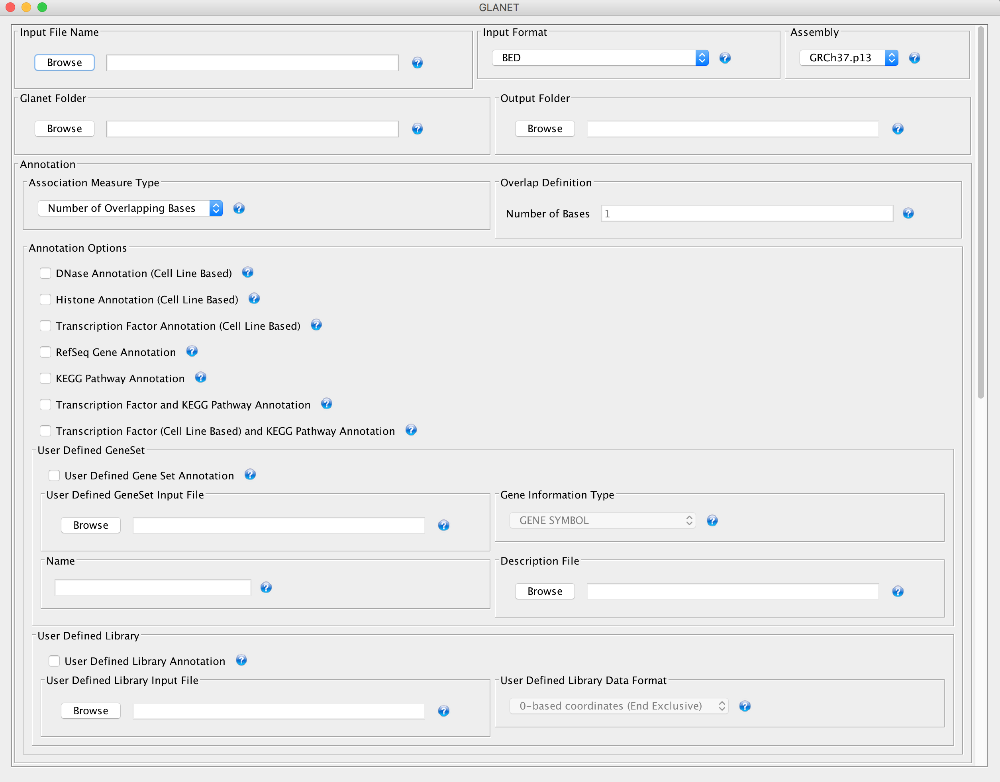
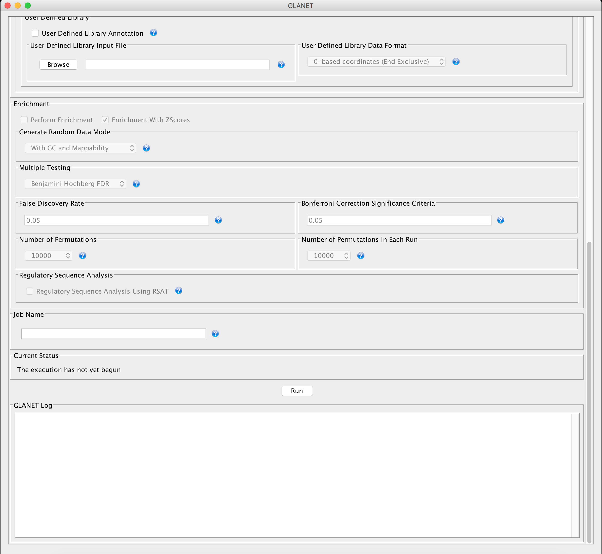
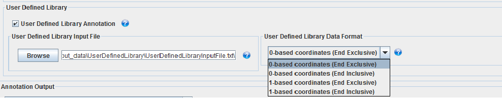
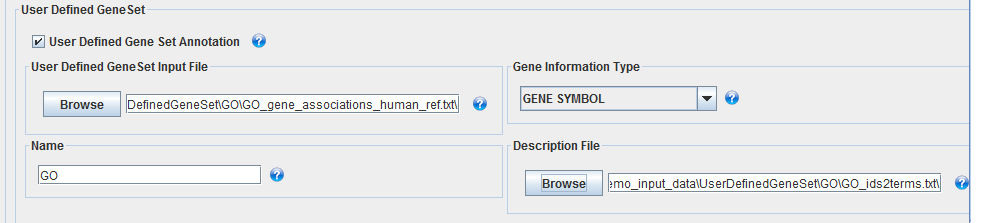

===============
GLANET Tutorial
===============

.. GLANET includes both graphical user interface (GUI) and command-line interface.
You can run GLANET using its graphical user interface (GUI) or command line arguments.

By double clicking the GLANET.jar you can open GLANET's GUI. In this case, GUI will be opened with default memory allocated for java applications depending on your operating system.
In order to allocate specific amount of memory for GLANET.jar and run it through its GUI, one should write the following basic command on Terminal (Linux or Mac OS X) or on Command Prompt (Windows)\*::

	$ java -Xms8G -Xmx8G −jar ~path/to/GLANET.jar

Note that with this command above, 8GM of memory is allocated for GLANET.jar. Depending on the number of intervals in the sets and number of samplings you want to achieve you may need to increase the memory accordingly.

In order to run GLANET.jar through command line arguments, in addition to the memory allocation parameter above, you must provide other arguments which are explained below.

Throughout the guide, we will use *~path/to/GLANET.jar* to indicate your absolute path to **GLANET.jar** and *~path/to/GLANET Folder/* to indicate your absolute path to **GLANET Folder**.

-------------------------------
GLANET Graphical User Interface
-------------------------------

   GLANET GUI Upper Part

GLANET provides Annotation by enabling user to annotate given genomic intervals w.r.t. ENCODE DNA regulatory elements, RefSeq genes,
predefined gene sets such as KEGG Pathways, user defined gene sets and user defined library.

Other features of GLANET includes Enrichment Analysis and Regulatory Sequence Analysis.

1)	**Input File Name**: (Mandatory)

	You have to provide input file which contains user given genomic intervals.
	Assume that Data.zip is extracted under a directory, let's call it **GLANET Folder**.
	Then sample input data can be reached from 

			   | ~path/to/GLANET Folder/Data/demo_input_data/

2)	**Input Format**: (Mandatory)

	GLANET supports input formats such as *dbSNP IDs*, *BED*, *GFF3*, *1-based coordinates (End Inclusive)* and *0-based coordinates (End Inclusive)*.
	For the user given input file, Input Format has to be selected accordingly.

	* *dbSNP IDs*
		-  Sample input data for *dbSNP IDs* can be reached at
		| ~path/to/GLANET Folder/Data/demo_input_data/CVD_rsIDs_Mediation.txt
		-  Input Format must be selected as *dbSNP IDs*.

	* *BED*
		-  Sample input data for *BED* can be reached at
		| ~path/to/GLANET Folder/Data/demo_input_data/
		| CVD_Mediation_0BasedStart_EndExclusive_GRCh37_p13_coordinates.bed
		-  Input Format must be selected as *BED*.

	* *GFF3*
		-  Sample input data for *GFF3* can be reached at
		| ~path/to/GLANET Folder/Data/demo_input_data/
		| test_input_data_GFF3_format.gff3
		-  Input Format must be selected as *GFF3*.

	* *1-based coordinates (End Inclusive)*
		-  Sample input data for *1-based coordinates (End Inclusive)* can be reached at
		| ~path/to/GLANET Folder/Data/demo_input_data/
		| OCD_GWAS_chrNumber_1Based_GRCh37_p13_Coordinates.txt
		-  Input Format must be selected as *1-based coordinates (End Inclusive)*.

	* *0-based coordinates (End Inclusive)*
		-  Sample input data for *0-based coordinates (End Inclusive)* can be reached at
		| ~path/to/GLANET Folder/Data/demo_input_data/
		| test_interval_data_K562_Usf2_0based_GRCh37_p13_Coordinates.txt
		-  Input Format must be selected as *0-based coordinates (End Inclusive)*.

3)	**Assembly**: (Mandatory for *BED*, *GFF3*, *1-based coordinates (End Inclusive)* or *0-based coordinates (End Inclusive)*)

	GLANET supports two assemblies.

	* *GRCh38*
		-  GRCh38 is also known as hg38
	* *GRCH37.p13 (hg19)*
		-  GRCh37.p13 is also known as hg19

	If *BED*, *GFF3*, *1-based coordinates (End Inclusive)* or *0-based coordinates (End Inclusive)* is chosen as Input Format, then Assembly has to be set as either *GRCh38* or *GRCH37.p13*.
	
	In case of dbSNP IDs, there is no need to set Assembly.

4)	**GLANET Folder**: (Mandatory)

	Set the GLANET Folder (e.g.:  ~path/to/GLANET Folder).
	Please note that GLANET Folder has to be the parent of Data Folder.

	| ~path/to/GLANET Folder/Data/

	
5)	**Annotation, Overlap Definition, Number of Bases**: (Mandatory)

	For Annotation, set the number of bases for overlap definition.
	e.g: Setting number of bases as *3* means that two intervals are accepted as overlapped if and only if these intervals have at least 3 overlapping bases.
	Default is *1* in order to handle the case where the SNPs are given as input data.

6) 	**Annotation, Annotation Options**: (At least one of the Annotation Option has to be checked)

	* *DNase Annotation (CellLine Based)*
		-  Check this check box, if you want to annotate given intervals w.r.t. ENCODE provided DNaseI hypersensitive sites.

	* *Histone Annotation (CellLine Based)*
		-  Check this check box, if you want to annotate given intervals w.r.t. ENCODE provided Histone modifications sites.

	* *Transcription Factor (TF) Annotation (CellLine Based)*
		-  Check this check box, if you want to annotate given intervals w.r.t. ENCODE provided Transcription Factors (TFs) binding sites.
		
	* *Gene Annotation* 
		-  Check this check box, if you want to annotate given intervals w.r.t. clade: Mammal, genome: Human, assembly: Feb. 2009 (GRCh37/hg19), RefSeq Genes.

	* *KEGG Pathway Annotation*
		-  Check this check box, if you want to annotate given intervals w.r.t. KEGG Pathways in exon-based, regulation-based and all-based manner.

	* *TF and KEGG Pathway Annotation*
		-  Check this check box, if you want to annotate given intervals concurrently w.r.t. Transcription Factors binding sites and KEGG Pathways in exon-based, regulation-based and all-based manner.
		This is a joint annotation which means that given interval, TF  and KEGG Pathway intervals overlap concurrently.
		Here, same TF with different cell lines are pooled.
		
		In other words, joint annotation requires trio overlaps.

	* *TF and KEGG Pathway Annotation (CellLine Based)*
		-  Check this check box, if you want to annotate given intervals concurrently w.r.t. Transcription Factors binding sites (CellLine Based) and KEGG Pathways in exon-based, regulation-based and all-based manner.
		This is a joint annotation which means that given interval, TF and KEGG Pathway intervals overlap concurrently.
	
		In other words, joint annotation requires trio overlaps.
		
	* *User Defined Gene Set Annotation*
		-  Check this check box, if you want to annotate given intervals w.r.t. User Defined Gene Set in exon-based, regulation-based and all-based manner.

		-  User Defined Gene Set Input File (Mandatory if *User Defined Gene Set Annotation* check box is checked.)
			-  User Defined Gene Set Input File contains tab delimited GeneSetID and Gene Information per line.
				| e.g:.: GO:0031424	LCE6A
				
			-  Sample User Defined Gene Set Input File can be reached at
			
			| ~path/to/GLANET Folder/Data/demo_input_data/UserDefinedGeneSet/GO/
			| GO_gene_associations_human_ref.txt

		-  Gene Information Type (Mandatory if *User Defined Gene Set Annotation* check box is checked.)
		   	-  GLANET supports three Gene Information Types:
		   	-  GENE ID (e.g.: 84561)
		   	-  GENE SYMBOL (e.g.: SLC12A8)
		   	-  RNA NUCLEOTIDE ACCESSION (e.g.: NM_024628)
			-  Choose the appropriate Gene Information Type. (e.g: Choose GENE SYMBOL if you have loaded GO_gene_associations_human_ref.txt as User Defined Gene Set Input File.)

		-  Name (Optional)
			-  You can give a name for the User Defined Gene Set
				| e.g.: GO
			-  Default Name is *NoName*.

		-  Description File (Optional)
			-  Desription File contains tab delimited GeneSetID and description of Gene Set per line.
				| e.g.: GO:0000001	mitochondrion inheritance
			
			-  Sample User Defined Gene Set Input File can be reached at
			
			   | ~path/to/GLANET Folder/Data/demo_input_data/UserDefinedGeneSet/GO/
			   | GO_ids2terms.txt

	* *User Defined Library Annotation*
	
		-  Check this check box, if you want to annotate given intervals w.r.t. User Defined Library.

		-  User Defined Library Input File (Mandatory if *User Defined Library Annotation* check box is checked.)
			-	In this input file, you list the file/s that you want to add into library. 
			- 	User Defined Library Input File contains tab delimited, 4 columns, ~path/to/file, ElementType, ElementName and Optional window-size value for considering window around summit in case of TF Data per line::

					G:\GLANET_DATA\ENCODE\transcription_factors\spp.optimal.wgEncodeBroadHistoneGm12878CtcfStdAlnRep0_VS_wgEncodeBroadHistoneGm12878ControlStdAlnRep0.narrowPeak	TF	CTCF_GM12878
			
			-	With an header line at the top, in each row of this input file, there are 4 columns separated by tab.
	
			-	Header Line describes the 4 columns in this input file.*
	
				|	![1. Column: FilePath_FileName]	[2. Column: ElementType]	[3. Column: ElementName]	[4. Column: Optional Column for considering window around summit in case of TF Data]

	
			-	*In the first column*
				Provide the path to the file including file name, these files can be of type bed, narrowPeak, pk or any text file having genomic intervals with their chr name, start position and end position separated by tab character in each row.
	
			-	*In the second column*
				Supply the element type e.g.: TF for transcription factors or HISTONE for histone modifications (TF or HISTONE are just examples, you name it),  
	
			-	*In the third column*
				Provide the specific name of this element in each file. Important point is that each file must consist of same element's genomic intervals. e.g.: CTCF_GM12878, H3K27ME3_GM12878.
	
			-	*In the fourth column*
				Provide this column for just considering window around summit in bps for narrowPeak files. Fourth column is optional.
			
			-	Sample User Defined Library Input File can be reached at
				
				| ~path/to/GLANET Folder/Data/demo_input_data/UserDefinedLibrary/
				| UserDefinedLibraryInputFile.txt
				
			-	The files referred in **UserDefinedLibraryInputFile.txt** are provided under
			
			   | ~path/to/GLANET Folder/Data/demo_input_data/UserDefinedLibrary/
			   | TranscriptionFactors/

			-	Please note that all the files that will be used in User Defined Library Annotation have to reside on your local machine.
			-	Sample files are provided under ~path/to/GLANET Folder/Data/demo_input_data/UserDefinedLibrary/TranscriptionFactors directory.
			-	Please update the absolute path of these files accordingly in UserDefinedLibraryInputFile.txt.
			-	Please change the **~path/to/file** column in **UserDefinedLibraryInputFile.txt** accordingly::

					G:\GLANET_DATA\ENCODE\transcription_factors\spp.optimal.wgEncodeBroadHistoneGm12878CtcfStdAlnRep0_VS_wgEncodeBroadHistoneGm12878ControlStdAlnRep0.narrowPeak	
				
				
		-  User Defined Library Data Format (Mandatory if *User Defined Library Annotation* check box is checked.)
		   Important point is that all the file/s listed in User Defined Library Input File must have same data format.
		   GLANET supports four Data Formats:
			
		   	-  0-based coordinates (End Exclusive)
		   	-  0-based coordinates (End Inclusive)
		   	-  1-based coordinates (End Exclusive)
		   	-  1-based coordinates (End Inclusive)
		   	
			Choose the appropriate the Data Format. 
			Choose 0-based coordinates (End Exclusive) if you have selected 

				| ~path/to/GLANET Folder/Data/demo_input_data/UserDefinedLibrary/
				| UserDefinedLibraryInputFile.txt

			as User Defined Library Input File.
			
			Choose 0-based coordinates (End Exclusive) for bed, narrowPeak and pk files.
			

   GLANET GUI Lower Part

7)	**Enrichment**: (Optional)

	* *Perform Enrichment*
		-  Check *Perform Enrichment* check box if you want to achieve Enrichment Analysis.
		   GLANET will accomplish Enrichment Analysis for the element types checked in Annotation Options.
        
		-  Perform Enrichment With Z-Scores (Default) 
		-  Perform Enrichment Without Z-Scores 
		 
		-  GLANET can be run with **with z-score** and **without z-score** modes. These two modes lead to different memory consumptions.
		-  When the **with z-score** calculation is requested, GLANET keeps test statistic calculated for each of the **B** random sampling and for each element **N** in the memory. 
		   Accumulation of test statistics is accomplished for each chromosome one at a time and therefore does not require  storing interval trees of all chromosomes in the memory concurrently.  
		   In this setting, memory consumption is **O(M + B*N)**, where **B** is the number of total samplings, **N** is the number of genomic elements being tested and **M** is the size of one interval tree constructed for each chromosome. 
		-  Running GLANET **without z-score** calculates the test statistic for each sampling and requires storing the interval trees for all chromosomes at the same time. 
		   Then, **without z-score** checks whether each sampling has test statistic greater than or equal to original (observed) test statistic. 
		   If yes, it increments the number of such samplings by one. As a result, although **without z-score** calculation increases memory consumption by requiring all of the interval trees for all chromosomes in memory at the same time, 
		   it decreases the memory consumption by not keeping test statistics for  each sampling for each element but just the number of samplings (that have test statistic greater than or equal to the original test statistic) per element. 
		   Thus, its memory consumption is proportional to **O(P+N)**, where **P** is the size of total number of interval trees. 
		-  This trade-off between running GLANET in **with z-score** mode or in **without z-score** mode can be solved by considering the number of total samplings **B** times number of elements **N** being analysed.  
		   When **B*N** is in hundreds of thousands, running GLANET with **with z-score** option could be too memory consuming; therefore, we recommend using **without z-score** option.		 
		
	* *Generate Random Data Mode*
		-  With GC and Mappability (default)
		-  Without GC and Mappability

	Choose the *Generate Random Data Mode* which can be either *With GC and Mappability* or *Without GC and Mappability*.
	Default is *With GC and Mappability*.

	* *Multiple Testing*
		-  Benjamini Hochberg FDR (Default)
		-  Bonferroni Correction

    Select the *Multiple Testing* procedure which can be either *Bonferroni Correction* or *Benjamini Hochberg FDR*.
	In fact, GLANET performs both of the Multiple Testing procedures but results are sorted w.r.t. the selected Multiple Testing procedure.
	Default is *Benjamini Hochberg FDR*.

	* *False Discovery Rate (FDR)*
		-  Default *False Discovery Rate (FDR)* is 0.05.

	* *Bonferroni Correction Significance Level*
		-  Default *Bonferroni Correction Significance Level* is 0.05.

	* *Number of Samplings*
		-  Choose the *number of samplings* among 5000, 10000, 50000 and 100000 choices.
		-  Start with smaller number of samplings, and increase number of samplings depending on your computer's performance.

	* *Number of samplings In Each Run*
		-  Choose the *number of samplings* in each run among 1000, 5000 and 10000 choices.
	e.g.: Do not forget that increasing the number of runs increases the GLANET execution time.
		-  	If your system performance is high in terms of CPU and RAM, prefer minimum number of runs.
		-  	You may have 10000 samplings, by achieving 10000 samplings in each run, which makes 10000/10000 = 1 run at total.
		-  	Or you may have 10000 samplings, by achieving 1000 samplings in each run, which makes 10000/1000 = 10 runs at total.

8)	**Regulatory Sequence Analysis**: (Optional)

		-  Please note that Regulatory Sequence Analysis is enabled if you have checked at least one of the following Annotation Options such as *TF*, *TF and KEGG Pathway* or *TF and KEGG Pathway (CellLine based)*.
		-  If you want to perform Regulatory Sequence Analysis, you must check the Regulatory Sequence Analysis using RSAT check box.
		-  	Regulatory Sequence Analysis requires *Annotation Output* drop down box selected as *Write Overlaps, Each One In Separate File (Element Based)* or *Write Overlaps, All In One File (Element Type Based)*.
		-  	Please notice that Regulatory Sequence Analysis is carried out for all of the annotated Transcription Factors.
		-  	Regulatory Sequence Analysis makes use of RSAT web services.

9)	**Job Name**: (Optional)

		-  	Please give a job name, then a directory named with this job name will be created under **~path/to/GLANET Folder/Output/JobName/**
		-  	Choose shorter job name so that all the sub folders to be created under **~path/to/GLANET Folder/Output/JobName/** directory will not exceed the allowable length.
		-  	Default is Job Name is  *NoName*.
	
**Log File**:
	
	GLANET run from GUI (by double clicking the GLANET.jar) will be logged in a log file. Log file will be saved under the same directory where the GLANET.jar resides.

--------------------------------------------------------
GLANET Command-Line Interface and Command-Line Arguments
--------------------------------------------------------

In the following table, command-line arguments and their prerequisite arguments, if any, are specified. 
A command-line argument is required if and only if its precondition argument(s) is specified.
You must set at most one parameter per argument. 
For example, if you set both -f0 and -fbed parameters for *Input File Format* argument, then the program will terminate by giving an error message. 
Details of the command-line arguments with sample runs are specified below. 
Note that parameter "-c" indicates that GLANET will run in command-line mode, not with GUI.

+-------------------------+---------------+-------------------+--------------+----------------------+
| Description             | Parameter     | Optional/Required | Precondition | Default Parameter    |
+=========================+===============+===================+==============+======================+
| Command-line            | `-c`_         |  Optional         | None         | None                 |
+-------------------------+---------------+-------------------+--------------+----------------------+
| Input File Name         | `-i`_         |  Required         | `-c`_        | None ("path/to/file")|
+-------------------------+---------------+-------------------+--------------+----------------------+
| Assembly                | `-grch37`_    |  Required         | `-c`_        | `-grch37`_           |
|                         +---------------+                   |              |                      |
|                         | `-grch38`_    |                   |              |                      |
+-------------------------+---------------+-------------------+--------------+----------------------+
| GLANET Folder           | `-g`_         |  Required         | `-c`_        | None ("path/to/file")|
+-------------------------+---------------+-------------------+--------------+----------------------+
| Output Folder           | `-o`_         |  Optional         | `-c`_        | GlanetFolder/Output/ |
+-------------------------+---------------+-------------------+--------------+----------------------+
| Input File Format       | `-f1`_        |  Required         | `-c`_        | `-fbed`_             |
|                         +---------------+                   |              |                      |
|                         | `-f0`_        |                   |              |                      |
|                         +---------------+                   |              |                      |
|                         | `-fbed`_      |                   |              |                      |
|                         +---------------+                   |              |                      |
|                         | `-fgff`_      |                   |              |                      |
|                         +---------------+                   |              |                      |
|                         | `-fdbsnp`_    |                   |              |                      |
+-------------------------+---------------+-------------------+--------------+----------------------+
| Association Measure     | `-noob`_      |  Required         | `-c`_        | `-noob`_             |
| Type                    +---------------+-------------------+--------------+----------------------+
|                         | `-eoo`_       |  Required         | `-c`_        | `-noob`_             |
+-------------------------+---------------+-------------------+--------------+----------------------+
| Number of Bases         | `-nb`_        |  Required         | `-eoo`_      | 1 (Integer)          |
+-------------------------+---------------+-------------------+--------------+----------------------+
| Annotation              | `-dnase`_     |  Optional         | `-c`_        | None                 |
|                         +---------------+-------------------+--------------+----------------------+
|                         | `-histone`_   |  Optional         | `-c`_        | None                 |
|                         +---------------+-------------------+--------------+----------------------+
|                         | `-tf`_        |  Optional         | `-c`_        | None                 |
|                         +---------------+-------------------+--------------+----------------------+
|                         | `-gene`_      |  Optional         | `-c`_        | None                 |
|                         +---------------+-------------------+--------------+----------------------+
|                         | `-kegg`_      |  Optional         | `-c`_        | None                 |
|                         +---------------+-------------------+--------------+----------------------+
|                         | `-tfkegg`_    |  Optional         | `-c`_        | None                 |
|                         +---------------+-------------------+--------------+----------------------+
|                         | `-tfcellkegg`_|  Optional         | `-c`_        | None                 |
|                         +---------------+-------------------+--------------+----------------------+
|                         | `-udgs`_      |  Optional         | `-c`_        | None                 |
|                         +---------------+-------------------+--------------+----------------------+
|                         | `-udl`_       |  Optional         | `-c`_        | None                 |
|                         +---------------+-------------------+--------------+----------------------+
|                         | `-udgsinput`_ |  Required         | `-udgs`_     | None ("path/to/file")|
|                         +---------------+-------------------+--------------+----------------------+
|                         | `-geneid`_    |  Required         | `-udgs`_     | `-genesym`_          |
|                         +---------------+                   |              |                      |
|                         | `-genesym`_   |                   |              |                      |
|                         +---------------+                   |              |                      |
|                         | `-generna`_   |                   |              |                      |
|                         +---------------+-------------------+--------------+----------------------+
|                         | `-udgsname`_  |  Optional         | `-udgs`_     | "NoName" (String)    |
|                         +---------------+-------------------+--------------+----------------------+
|                         | `-udgsdfile`_ |  Optional         | `-udgs`_     | None ("path/to/file")|
|                         +---------------+-------------------+--------------+----------------------+
|                         | `-udlinput`_  |  Required         | `-udl`_      | None ("path/to/file")|
|                         +---------------+-------------------+--------------+----------------------+
|                         | `-udldf0exc`_ |  Required         | `-udl`_      | `-udldf0exc`_        |
|                         +---------------+                   |              |                      |
|                         | `-udldf0inc`_ |                   |              |                      |
|                         +---------------+                   |              |                      |
|                         | `-udldf1exc`_ |                   |              |                      |
|                         +---------------+                   |              |                      |
|                         | `-udldf1inc`_ |                   |              |                      |
|                         +---------------+-------------------+--------------+----------------------+
|                         | `-aos`_       |  Required         | `-c`_        | `-aos`_              |
|                         +---------------+                   |              |                      |
|                         | `-aoo`_       |                   |              |                      |
|                         +---------------+                   |              |                      |
|                         | `-aon`_       |                   |              |                      |
+-------------------------+---------------+-------------------+--------------+----------------------+
| Enrichment              | `-e`_         |  Optional         |`-dnase`_ or  | None                 |
|                         |               |                   +--------------+                      |
|                         |               |                   |`-tf`_ or     |                      |
|                         |               |                   +--------------+                      |
|                         |               |                   |`-histone`_ or|                      |
|                         |               |                   +--------------+                      |
|                         |               |                   |`-gene`_ or   |                      |
|                         |               |                   +--------------+                      |
|                         |               |                   |`-kegg`_ or   |                      |
|                         |               |                   +--------------+                      |
|                         |               |                   |`-tfkegg`_ or |                      |
|                         |               |                   +--------------+                      |
|                         |               |                   |`-udgs`_ or   |                      |
|                         |               |                   +--------------+                      |
|                         |               |                   |`-udl`_ or    |                      |
|                         |               |                   +--------------+                      |
|                         |               |                   |`-tfcellkegg`_|                      |
|                         +---------------+-------------------+--------------+----------------------+
|                         | `-wzs`_       |  Required         | `-e`_        | `-wzs`_              |
|                         +---------------+                   |              |                      |
|                         | `-wozs`_      |                   |              |                      |
|                         +---------------+-------------------+--------------+----------------------+
|                         | `-wgcm`_      |  Required         | `-e`_        | `-wgcm`_             |
|                         +---------------+                   |              |                      |
|                         | `-wogcm`_     |                   |              |                      |
|                         +---------------+-------------------+--------------+----------------------+
|                         | `-wif`_       |  Required         | `-e`_        | `-woif`_             |
|                         +---------------+                   |              |                      |
|                         | `-woif`_      |                   |              |                      |
|                         +---------------+-------------------+--------------+----------------------+
|                         | `-bh`_        |  Required         | `-e`_        | `-bh`_               |
|                         +---------------+                   |              |                      |
|                         | `-bonf`_      |                   |              |                      |
|                         +---------------+-------------------+--------------+----------------------+
|                         | `-fdr`_       |  Required         | `-e`_        | 0.05 (Float)         |
|                         +---------------+-------------------+--------------+----------------------+
|                         | `-sl`_        |  Required         | `-e`_        | 0.05 (Float)         |
|                         +---------------+-------------------+--------------+----------------------+
|                         | `-s`_         |  Required         | `-e`_        | 10000 (Integer)      |
|                         +---------------+-------------------+--------------+----------------------+
|                         | `-se`_        |  Required         | `-e`_        | 5000 (Integer)       |
+-------------------------+---------------+-------------------+--------------+----------------------+
| RSA                     | `-rsa`_       |  Optional         |`-tf`_ or     | None                 |
|                         |               |                   +--------------+                      |
|                         |               |                   |`-tfkegg`_ or |                      |
|                         |               |                   +--------------+                      |
|                         |               |                   |`-tfcellkegg`_|                      |
+-------------------------+---------------+-------------------+--------------+----------------------+
| Job Name                | `-j`_         |  Optional         | `-c`_        | "NoName" (String)    |
+-------------------------+---------------+-------------------+--------------+----------------------+
| Number of Threads       | `-t`_         |  Optional         | `-c`_        | 80% of all processors|
+-------------------------+---------------+-------------------+--------------+----------------------+
| Log File                | `-l`_         |  Optional         |              | `-nl`_               |
|                         +---------------+                   |              |                      |
|                         | `-nl`_        |                   |              |                      |
+-------------------------+---------------+-------------------+--------------+----------------------+

------------------------------------
Command-Line Parameters Descriptions
------------------------------------

There are several parameters that are either required or optional to make GLANET run in Terminal or in Command Prompt. 
Whether a parameter is required or not will be specified as we describe it. 
The order of parameters is not fixed. One may set the parameters in any order. 
Some parameters may require some other parameters to be set as preconditions, which will also be indicated. 
You can see the preconditions of a parameter as shown in `GLANET Command-Line Interface and Command-Line Arguments`_

-c
^^

To enable GLANET to run in Terminal or Command Prompt, it must be indicated with :option:`-c` option. If there is no such option specified, program will run with its graphical user interface.

-i
^^

**Required** if :option:`-c` is set. Absolute input file location must be specified just after :option:`-i` option.

.. Unless the correct path location is specified after :option:`-i`, the program may run unexpectedly. You are responsible to indicate the correct path to the input file.

-grch37
^^^^^^^

**Required** if :option:`-c` is set. This option specifies assembly of input data as GRCh37.p13. If you do not set anything, :option:`-grch37` is set as default.

-grch38
^^^^^^^

**Required** if :option:`-c` is set. This option specifies assembly of the input data as GRCh38. If you do not set anything, :option:`-grch37` is set as default.

-g
^^

**Required** if :option:`-c` is set. Glanet folder location must be specified just after writing :option:`-g`.
Do not forget that GLANET folder must have the Data folder as its sub folder.

-o
^^

Specifies the output folder where the results will be written under. The folder location must be specified after :option:`-o`. If the folder does not exists, GLANET creates one.

-f1
^^^

**Required** if :option:`-c` is set. One of the input data format options ( :option:`-f1`, :option:`-f0`, :option:`-fbed`, :option:`-fgff`, :option:`-fdbsnp`) must be specified. 
This option specifies that input file contains 1-based coordinates (End Inclusive) per line.

-f0
^^^

**Required** if :option:`-c` is set. This option specifies that input file contains 0-based coordinates (End Inclusive) per line. See also `-f1`_.

-fbed
^^^^^

**Required** if :option:`-c` is set. This option specifies that input file format is BED. See also `-f1`_.

-fgff
^^^^^

**Required** if :option:`-c` is set. This option specifies that input file format is GFF3. See also `-f1`_.

-fdbsnp
^^^^^^^

**Required** if :option:`-c` is set. This option specifies that input file contains dbSNP IDs per line. See also `-f1`_.

-noob
^^^^^
**Required** if :option:`-c` is set. This option specifies that association measure type is Number of Overlapping Bases, it can be 0 or more. See also `-eoo`_.

-eoo
^^^^
**Required** if :option:`-c` is set. This option specifies that association measure type is Existence of Overlap, it is either 0 or 1. See also `-noob`_.

-nb
^^^
**Required** if :option:`-eoo` is set. This option sets the number of bases that must overlap in order to accept two intervals as overlapping intervals. A positive integer value must be specified as the parameter. If you do not set anything, default option is :option:`-nb 1`.

-dnase
^^^^^^

This option enables DNase Hypersensitive Sites (Cell Line Based) annotation.

-histone
^^^^^^^^

This option enables Histone Modifications Sites (Cell Line Based) annotation.

-gene
^^^^^

This option enables clade: Mammal, genome: Human, assembly: Feb. 2009 (GRCh37/hg19),  RefSeq Genes annotation.

-tf
^^^

This option enables Transcription Factors Binding Sites (Cell Line Based) annotation.

-kegg
^^^^^

This option enables KEGG Pathway annotation.

-tfkegg
^^^^^^^

This option enables joint Transcription Factor Binding Sites and KEGG Pathway annotation.

-tfcellkegg
^^^^^^^^^^^^

This option enables joint Transcription Factor Binding Sites (Cell Line Based) and KEGG Pathway annotation.

-udgs
^^^^^

This option enables user defined gene set annotation.

-udgsinput
^^^^^^^^^^

**Required** if :option:`-udgs` is set. This option specifies user defined gene set input file. 
Absolute input file location must be specified as the parameter.

-genesym
^^^^^^^^

**Required** if :option:`-udgs` is set. This option specifies gene information type as "Gene Symbol". 
One of the gene information type (:option:`-geneid`, :option:`-genesym`, :option:`-generna`) must be specified. 
If you do not set any of these options, default option is :option:`-genesym`

-geneid
^^^^^^^

**Required** if :option:`-udgs` is set. This option specifies gene information type as "Gene Id". See also `-genesym`_.

-generna
^^^^^^^^

**Required** if :option:`-udgs` is set. This option specifies gene information type as "RNA Nucleotide Accession". See also `-genesym`_.

-udgsname
^^^^^^^^^

This option gives a name for the user defined gene set.

-udgsdfile
^^^^^^^^^^

This option specifies the user defined gene set description file location. 
Absolute file location must be specified as the parameter.

-udl
^^^^

This option enables User Defined Library Annotation.

-udlinput
^^^^^^^^^

**Required** if :option:`-udl` is set. This option specifies User Defined Library Input File. 
Absolute input file location must be specified as the parameter.

-udldf0exc
^^^^^^^^^^

**Required** if :option:`-udl` is set. 
This option specifies User Defined Library Data Format as "0-based coordinates (End exclusive)". 
One of the data format (:option:`-udldf0exc`, :option:`-udldf0inc`, :option:`-udldf1exc`, :option:`-udldf1inc`) must be specified. 
If you do not set any of these options, default option is :option:`-udldf0exc`

-udldf0inc
^^^^^^^^^^

**Required** if :option:`-udl` is set.
This option specifies User Defined Library Data Format as "0-based coordinates (End inclusive)". See also `-udldf0inc`_.

-udldf1exc
^^^^^^^^^^

**Required** if :option:`-udl` is set.
This option specifies User Defined Library Data Format as "1-based coordinates (End exclusive)". See also `-udldf0inc`_.

-udldf1inc
^^^^^^^^^^

**Required** if :option:`-udl` is set.
This option specifies User Defined Library Data Format as "1-based coordinates (End inclusive)". See also `-udldf0inc`_.

-aos
^^^^
If this option is specified, GLANET outputs annotation results in element based separate files. See also `-aoo`_.

-aoo
^^^^
If this option is specified, GLANET outputs annotation results for all elements of the same element type in one file. See also `-aos`_.

-aon
^^^^
If this option is specified, GLANET does not output annotation results at all.

-e
^^

If this option is specified, GLANET performs enrichment. 
Enrichment operation requires at least one annotation option (:option:`-dnase`, :option:`-histone`, :option:`-tf`, :option:`-kegg`, :option:`-tfkegg`, :option:`-tfcellkegg`, :option:`-udgs`, :option:`-udl`) to be set.

-wzs
^^^^
If this option is specified, GLANET performs enrichment with z-scores.

-wozs
^^^^^
If this option is specified, GLANET performs enrichment without z-scores.
:option:`-wozs` is only available for :option:`-eoo`.

-wgcm
^^^^^

**Required** if :option:`-e` is set. 
This option generates random data with GC and Mapability. 
You must either set :option:`-wgcm` or :option:`-wogcm` to specify generating random data mode. 
If you do not set anything, default option is :option:`-wgcm`.

-wogcm
^^^^^^

**Required** if :option:`-e` is set. 
This option generates random data without GC and Mapability.
See also `-wgcm`_.

-wif
^^^^
If this option is specified, GLANET performs random interval generation using random interval selected from corresponding isochore family pool.
If you do not set anything, default option is :option:`-woif`.
See also `-woif`_.

-woif
^^^^^
If this option is specified, GLANET performs random interval generation without isochore family pool.
If you do not set anything, default option is :option:`-woif`.
See also `-wif`_.

-bh
^^^

**Required** if :option:`-e` is set. 
This option sets Multiple Testing correction as "Benjamini-Hochberg FDR". 
You must either set :option:`-bh` or :option:`-bonf` to specify multiple testing correction option. 
If you do not set anything, default option is :option:`-bh`.

-bonf
^^^^^

**Required** if :option:`-e` is set. 
This option sets Multiple Testing correction as "Bonferroni Correction". 
See also `-bh`_.

-fdr
^^^^

**Required** if :option:`-e` is set. 
This option followed by a float value sets False Discovery Rate for Benjamini-Hochberg multiple testing. 
Default option is :option:`-fdr 0.05`.

-sl
^^^

**Required** if :option:`-e` is set. 
This option followed by a float value sets Significance Level for Bonferroni Correction multiple testing. 
Default option is :option:`-sl 0.05`.

-s
^^

**Required** if :option:`-e` is set. 
This option followed by an integer value sets the total number of samplings in Enrichment. 
Default option is :option:`-s 10000`.

-se
^^^

**Required** if :option:`-e` is set. 
This option followed by an integer value sets number of samplings in each run. 
Default option is :option:`-se 5000`.

-rsa
^^^^

If this option is set, GLANET performs Regulatory Sequence Analysis using RSAT. 
:option:`-rsa` requires that given intervals consist of SNPs and at least one of the following annotations to be set (:option:`-tf`, :option:`-tfkegg` :option:`-tfcellkegg`) as preconditions. 
:option:`-rsa` requires :option:`-aos` or :option:`-aoo` selected as GLANET annotation results output option.
Otherwise Regulatory Sequence Analysis is not performed. 

-j
^^

It sets Job Name that GLANET is about to perform. 
It creates an output folder with the specified Job Name. 
Results will be collected under this folder. 
Job Name must be specified as the parameter. 
If you do not set anything, default option is :option:`-j NoName`.

-t
^^

This option followed by an integer value sets the number of threads allocated for the GLANET run. If the option is not specified, the default value is the 80% of the all processors available in the system. If the number of threads specified exceeds the maximum available threads in your system, maximum available threads will be used.

-l
^^

If this option is set, GLANET Run is written to a log file. Log file will be saved under the directory where the GLANET command-line run is achieved.

-nl
^^^

If this option is set, GLANET Run is not written to a log file.

-------------------------------------------------------------
GLANET Annotation and Enrichment for OCD GWAS SNPs Sample Run
-------------------------------------------------------------
**GLANET Command Line Arguments**::

	$ java -Xms8G -Xmx8G −jar "path/to/GLANET.jar" -c -g "path/to/GLANET Folder/" -i "path/to/GLANET Folder/Data/demo_input_data/OCD_GWAS_chrNumber_1Based_GRCh37_p13_Coordinates.txt" -f1 -dnase -histone -tf -tfkegg -e -s 10000  -se 10000 -l -j "SampleOCDGWASSNPs"

------------------------------------------------------------
GLANET Annotation and Enrichment for srf.hg19.bed Sample Run
------------------------------------------------------------

**GLANET Command Line Arguments**::

	$ java -Xms8G -Xmx8G −jar "path/to/GLANET.jar" -c -g "path/to/GLANET Folder/" -i "path/to/GLANET Folder/Data/demo_input_data/GAT_Comparison_Data/srf.hg19.bed" -fbed -tf -e -s 10000 -se 10000 -l -j "SampleSRF"
		
----------------------------------------------------------------
GLANET Regulatory Sequence Analysis for OCD GWAS SNPs Sample Run
----------------------------------------------------------------

**GLANET Command Line Arguments**::

	$ java -Xms8G -Xmx8G −jar "path/to/GLANET.jar" -c -g "path/to/GLANET Folder/" -i "path/to/GLANET Folder/Data/demo_input_data/OCD_GWAS_SIGNIFICANT_SNP_RSIDs.txt" -fdbsnp -tf -rsa  -l -j "SampleRSA"
	
--------------------------------------
GLANET User Defined Library Sample Run
--------------------------------------

**You can add your own library for annotation and enrichment analysis.**

**In order to make a demo for User Defined Library Feature of GLANET using GUI:**

	1. Load *OCD_GWAS_chrNumber_1Based_GRCh37_p13_Coordinates.txt* under ~path/to/GLANET Folder/Data/demo_input_data/ as Input File Name.
	
	2. Choose *1-based coordinates (End Inclusive)* as Input Format.
	
	3. Set GLANET Folder (*~path/to/GLANET Folder/*) where GLANET Folder must be parent directory of Data directory.

	4. Set Output Folder as you wish.
	
	5. Check *User Defined Library Annotation* check box in the User Defined Library panel.
	
	6. Load *UserDefinedLibraryInputFile.txt* under  *~path/to/GLANET Folder/Data/demo_input_data/UserDefinedLibrary/* as User Defined Library Input File.
	
	7. Choose *0-based coordinates (End Exclusive)* as User Defined Library Data Format.

	8. Check *Perform Enrichment* Check Box.
	
	9. Provide a *Job Name* as you wish.
	
	10. Leave the other options set as default.
	
	11. Then click on Run button.

	

   GLANET User Defined Library
   

**In order to make a demo for User Defined Library Feature of GLANET using Command Line Arguments**::

	$ java -Xms16G -Xmx16G -jar "path/to/GLANET.jar" -c -g "path/to/GLANET Folder/" -i "path/to/GLANET Folder/Data/demo_input_data/OCD_GWAS_chrNumber_1Based_GRCh37_p13_Coordinates.txt" -grch37 -f1 -eoo -nb 1 -udl -udlinput "path/to/GLANET Folder/Data/demo_input_data/UserDefinedLibrary/UserDefinedLibraryInputFile.txt" -udldf0exc  -e -wzs -wgcm -bh -s 10000 -se 10000 -l -j "SampleUDL"

**You can also reach main steps of User Defined Library Feature of GLANET in ReadMe.txt under  ~path/to/GLANET Folder/Data/demo_input_data/UserDefinedLibrary/.**
	
---------------------------------------
GLANET User Defined Gene Set Sample Run
---------------------------------------

**You can add your own user defined gene sets for annotation and enrichment analysis.**

**In order to make a demo for User Defined Gene Set Feature of GLANET using GUI:**

	* *Load OCD_GWAS_chrNumber_1Based_GRCh37_p13_Coordinates.txt under ~path/to/GLANET Folder/Data/demo_input_data/ as Input File Name.*
	
	* *Choose 1-based coordinates (End Inclusive) as Input Format.*
	
	* *Set GLANET Folder (~path/to/GLANET Folder/) where GLANET Folder must be set as the parent directory of Data directory.*

	* *Set Output Folder as you wish.*
	
	* *Check User Defined Gene Set Annotation check box in the User Defined Gene Set panel.*
	
	* *Load GO_gene_associations_human_ref.txt under ~path/to/GLANET Folder/Data/demo_input_data/UserDefinedGeneSet/GO/ as User Defined Gene Set Input File.*
	User Defined Gene Set Input File lists each gene in a gene set in one line, in row-based manner.
	Namely, there will be n lines/rows for a gene set that consists of n genes.
	User Defined Gene Set Input File is two column (tab separated) text file where first column has the gene set name and the second column has the gene that gene set includes.
	(A row from User Defined Gene Set Input File, e.g.: GO:0003779	MACF1)
	
	* *Set Gene Symbol as Gene Information Type.*
	The second column of User Defined Gene Set Input File can provide gene information as Gene Symbol (e.g.: MACF1), Gene ID (e.g.: 23499), or RNA Nucleotide Accession (e.g.: NM_012090).
	The important point is that second column must provide the gene information with the same Gene Information Type.
	
	* *Set Name as you wish, e.g.: Let's name it as GO since User Defined Gene Set Input File consists of GO Terms.*
	
	* *Load GO_ids2terms.txt under ~path/to/GLANET Folder/Data/demo_input_data/UserDefinedGeneSet/GO/ as Description File.*
	Description File is a two column (tab separated) text file where first column has the gene set name and the second column has gene set description.
	(A row from Description File, e.g.: GO:0003779	actin binding)
	
	* *Check Perform Enrichment Check Box.*
	
	* *Provide a Job Name as you wish.*
	
	* *Let the other options set as default.*
	
	* *Then click on Run button.*
	

   GLANET User Defined Gene Set
   

**In order to make a demo for User Defined Gene Set Feature of GLANET using Command Line Arguments**::

	$ java -Xms16G -Xmx16G -jar "path/to/GLANET.jar" -c -g "path/to/GLANET Folder/" -i "path/to/GLANET Folder/Data/demo_input_data/OCD_GWAS_chrNumber_1Based_GRCh37_p13_Coordinates.txt" -grch37 -f1 -eoo -nb 1  -udgs -udgsinput "path/to/GLANET Folder/Data/demo_input_data/UserDefinedGeneSet/GO/GO_gene_associations_human_ref.txt" -genesym -udgsname "GO" -udgsdfile "path/to/GLANET Folder/Data/demo_input_data/UserDefinedGeneSet/GO/GO_ids2terms.txt" -e -wgcm -s 10000 -se 10000 -l -j "SampleUDGS"

**You can also reach main steps of User Defined Gene Set Feature of GLANET in ReadMe.txt under  ~path/to/GLANET Folder/Data/demo_input_data/UserDefinedGeneSet/GO/.**	

------------------------------------------
Additional GLANET Command-Line Sample Runs
------------------------------------------

 Example Annotation Run is as following (Number of threads specified explicitly)::

	$ java -Xms8G -Xmx8G −jar "path/to/GLANET.jar" -c -g "path/to/GLANET Folder/" -i "path/to/GLANET Folder/Data/demo_input_data/CVD_all_1_based_coordinates.txt" -f1 -grch37 -eoo -dnase -histone -tf -kegg -tfkegg -l -j "SampleRun1" -t 16

 Example Annotation and Enrichment Run is as following (Enrichment without ZScores)::

	$ java -Xms8G -Xmx8G −jar "path/to/GLANET.jar" -c -g "path/to/GLANET Folder/" -i "path/to/GLANET Folder/Data/demo_input_data/OCD_GWAS_chrNumber_1Based_GRCh37_p13_Coordinates.txt" -f1 -dnase -histone -tfcellkegg -e -wozs -se 10000 -l -j "SampleRun2"

 Example Annotation and Enrichment Run is as following (Enrichment without GC and Mapability)::

	$ java -Xms8G -Xmx8G −jar "path/to/GLANET.jar" -c -g "path/to/GLANET Folder/" -i "path/to/GLANET Folder/Data/demo_input_data/OCD_GWAS_chrNumber_1Based_GRCh37_p13_Coordinates.txt" -f1 -dnase -histone -tfcellkegg -kegg -e -wogcm -se 10000  -l -j "SampleRun3"

 Example Annotation (Number of Overlapping Bases is chosen as Association Measure Type) is as following::

	$ java -Xms8G -Xmx8G −jar "path/to/GLANET.jar" -c -g "path/to/GLANET Folder/" -i "path/to/GLANET Folder/Data/demo_input_data/CVD_all_1_based_coordinates.txt" -f1 -histone -noob -tf -l -j "SampleRun4"

.. Example Annotation and Enrichment Run is as following (Output folder specified explicitly)::
..	$ java -Xms8G -Xmx8G −jar "path/to/GLANET.jar" -c -g "path/to/GLANET Folder/" -i "path/to/GLANET Folder/Data/demo_input_data/OCD_GWAS_SIGNIFICANT_SNP_RSIDs_all.txt" -o "path/to/Desired Output Location" -fdbsnp -dnase -histone -kegg -e -se 10000  -l -j "SampleRun2"
.. Example Annotation and Enrichment and Regulatory Sequence Analysis Run is as following::
..	$ java -Xms8G -Xmx8G −jar "path/to/GLANET.jar" -c -g "path/to/GLANET Folder/" -i "path/to/GLANET Folder/Data/demo_input_data/OCD_GWAS_SIGNIFICANT_SNP_RSIDs_all.txt" -fdbsnp -dnase -histone -tf -tfkegg -rsa -e -s 5000  -l -j "SampleRun5"
..		-  Perform Enrichment With Z-Scores (Default) ranks elements w.r.t. their z-scores in addition to their empirical, Bonferroni corrected and Benjamini Hochberg FDR adjusted p values.
..		-  Perform Enrichment Without Z-Scores is recommended when you have hundreds of thousands of elements to be analysed (e.g. In case of Cell Line Based TF and KEGG Pathway Analysis).
..		-  Do not check Perform Enrichment With Z-Scores if you have hundreds of thousands of elements and you don't have enough memory (at least 16GB)
	